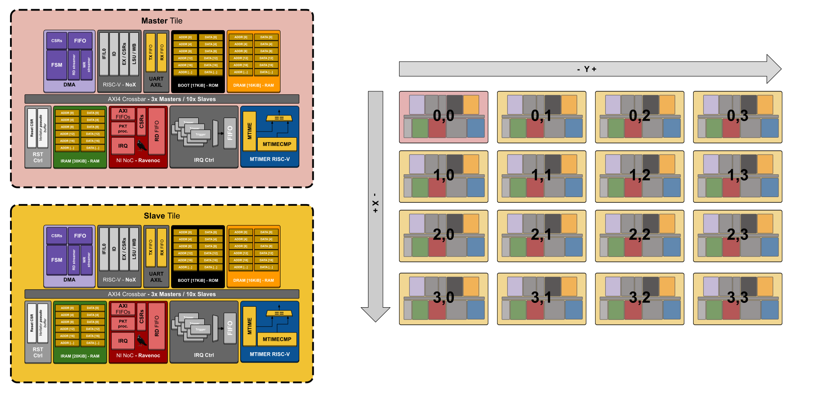

# IPSoC gen - MPSoC template project

In this branch we have the **MPSoC** template design built with IP SoC gen. It contains all the RTL related to the `MPSoC` design with all submodules and a testbench in cpp that you can run in your native Linux machine. Also it is available too an option to build an FPGA image to test with real hw.

## MPSoC Configuration
The MPSoC configuration used in this template follows the below memory map. This configuration is available [here](https://github.com/aignacio/ipsocgen/blob/main/ipsocgen/examples/template_mpsoc.yaml) and its output can be generated using the following command:
```bash
ipsocgen -c template_mpsoc.yaml
```

## MPSoC Emulator (in cpp)

You can easily build the MPSoC to run natively in your `Linux` machine or run with docker (default option). The docker container is available in my docker-hub repository [`aignacio`](https://hub.docker.com/u/aignacio). If you do not change the default hw settings, you should be good with the following cmds, but if you decider to change the number of slaves/masters of update the memories, please make sure you update those in the `makefile` (section **Parameters of simulation**). The emulator will expect two `.elf` files that will be loaded into the Tiles before running the simulation.
```bash
make all # build the cpp simulator of the MPSoC with waves dump enabled
make run_test # run the MPSoC basic fw with the master_tile.elf / slave_tile.elf, these two fws needs to be copied to this folder using the mpsoc sw repository
```

## Build for FPGA

For the FPGA image builds, it is used [`FuseSoC`](https://fusesoc.readthedocs.io) so there are a few targets available, by the time this README is written maybe not all targets are fully working i.e you need to tweak the .xdc a little bit in order to update the in/out pins. However at this time, you can try:

```bash
make add_lib # add locally core to fusesoc lib
make fpga_kintex # builds for the K7 qmtech FPGA board
```

## Hardware architecutre diagram

This architecture diagram describe the **MPSoC** hardware considering a 4x4 NoC (Network-on-chip) with 1x Master tile and 15x Slave tiles. The design is fully written in SystemVerilog and it should be easy to change replacing masters/slaves by touching the files available at [`rtl`](rtl) folder.


